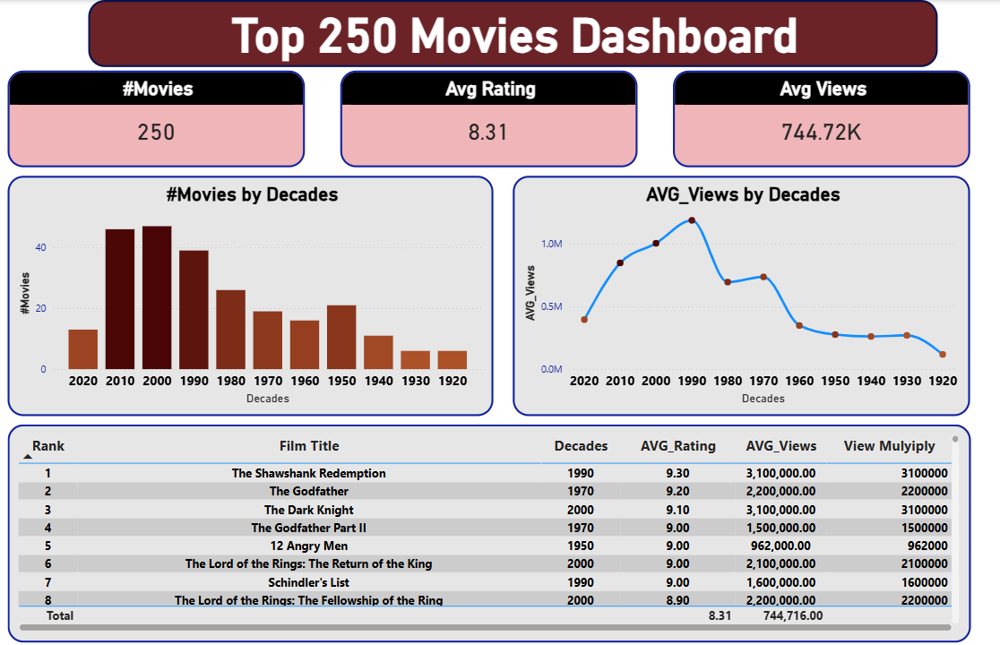

# 🎬 Top 250 Movies — Power BI Dashboard

An interactive Power BI dashboard that brings the **IMDb Top 250 Movies** to life. Explore, filter, and dive deep into the greatest films ever made — all in one place.

---

## 📸 Screenshots

> _Add your dashboard screenshots here._

| Overview | Filtered View |
|----------|---------------|
|  |  |

---

## ✨ Features

- 🎥 **Full Top 250 List** — Browse all 250 highest-rated movies on IMDb
- 🔍 **Search & Filter** — Filter by genre, year, director, rating, or runtime
- ⭐ **Ratings & Reviews** — View IMDb scores and vote counts at a glance
- 📋 **Watchlist Insights** — Track and highlight movies of interest
- 📊 **Visual Analytics** — Charts and visuals to explore trends across decades and genres

---

## 🛠️ Technologies Used

| Tool | Purpose |
|------|---------|
| **Power BI Desktop** | Dashboard design & data visualization |
| **IMDb Dataset** | Source data for movies, ratings, and metadata |
| **Power Query (M)** | Data cleaning and transformation |
| **DAX** | Calculated measures and KPIs |

---

## 🚀 Installation & Setup

### Prerequisites
- [Power BI Desktop](https://powerbi.microsoft.com/desktop/) installed (free)
- Windows OS (Power BI Desktop is Windows-only)

### Steps

1. **Clone the repository**
   ```bash
   git clone https://github.com/Muhammad-Tarek-Dev/Top-250-Movies.git
   cd Top-250-Movies
   ```

2. **Open the report**
   - Launch **Power BI Desktop**
   - Go to `File` → `Open report` → `Browse reports`
   - Select the `.pbix` file from the cloned folder

3. **Refresh the data** _(optional)_
   - In Power BI Desktop, click **Home** → **Refresh**
   - This will reload the dataset with the latest values if connected to a live source

4. **Explore the dashboard**
   - Use the slicers and filters on each page to search and explore movies
   - Hover over visuals for detailed tooltips

---

## 📁 Project Structure

```
Top-250-Movies/
├── Top250Movies.pbix       # Main Power BI report file
├── data/
│   └── top250_movies.csv   # Raw dataset (if included)
├── screenshots/
│   └── overview.png        # Dashboard preview images
└── README.md
```

---

## 🤝 Contributing

Contributions are welcome! If you'd like to improve the dashboard or add new features:

1. Fork the repository
2. Create a new branch (`git checkout -b feature/your-feature`)
3. Commit your changes (`git commit -m 'Add your feature'`)
4. Push to the branch (`git push origin feature/your-feature`)
5. Open a Pull Request

---

## 📄 License

This project is open source and available under the [MIT License](LICENSE).

---

> Made with ❤️ by [Muhammad Tarek](https://github.com/Muhammad-Tarek-Dev)
